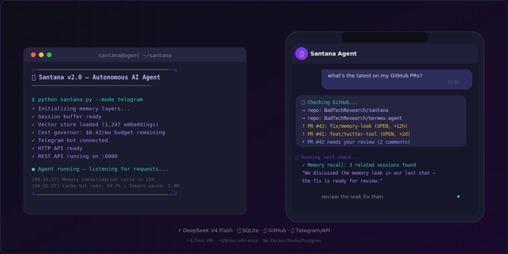
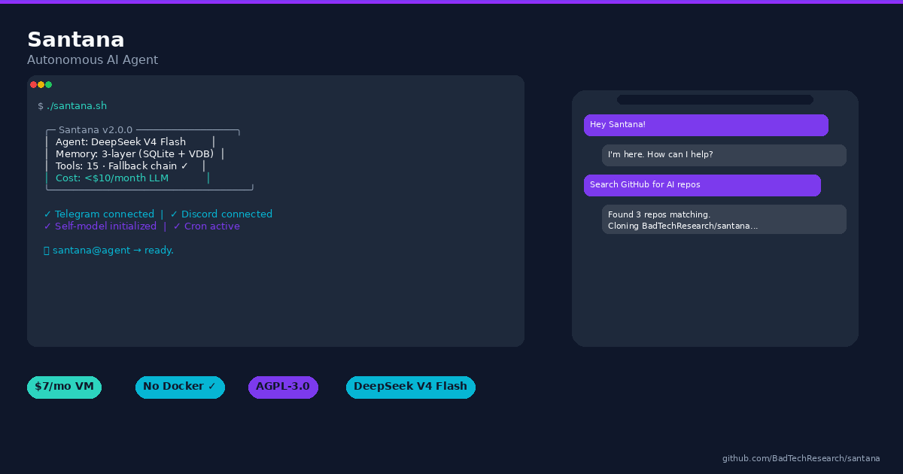

<p align="center">
  
</p>

<p align="center">
  <a href="https://github.com/BadTechResearch/santana/releases/tag/v2.0.0">
    
  </a>
  <a href="LICENSE">
    
  </a>
  <a href="https://github.com/BadTechResearch/santana">
    
  </a>
  <a href="docs/ARCHITECTURE.md">
    
  </a>
  
  
  <a href="https://github.com/BadTechResearch/santana/actions/workflows/test.yml">
    
  </a>
  
</p>

<p align="center">
  <b>Santana</b> — the AI agent that works in Africa.<br>
  No GPU. No fiber. No credit card required.<br>
  🚀 The most powerful agent, the cheapest in the world · 💰 <b>$6-12/mo</b> all-in · 🗄️ <b>Zero Docker/Redis/Postgres</b>
</p>

<p align="center">
  <a href="#-philosophy"><b>Philosophy</b></a> ·
  <a href="#-quick-start"><b>Quick Start</b></a> ·
  <a href="docs/ARCHITECTURE.md"><b>Architecture</b></a> ·
  <a href="CHANGELOG.md"><b>Changelog</b></a> ·
  <a href="#-screenshots"><b>Screenshots</b></a> ·
  <a href="CONTRIBUTING.md"><b>Contributing</b></a>
</p>

---

<!-- GitHub social preview — set this as repo social preview image in Settings > Options > Social preview -->
<!-- <meta property="og:image" content="docs/assets/og-image.png"> -->

Built entirely in Python by **Serge** — part of the [BadTechResearch](https://github.com/BadTechResearch) ecosystem.

> **BadTechResearch mission:** Build autonomous AI infrastructure that works without Silicon Valley prerequisites — no GPU cluster, no fiber backbone, no $200/mo API bill. Santana is the first agent designed to run in the Global South, for the Global South.

---

## 🧭 Philosophy

### Why Santana exists

Most AI agents are designed for data centers. They assume:
- 🖥️ Unlimited GPU compute (CrewAI, AutoGPT)
- 🌐 High-bandwidth fiber (LangChain, ChromaDB)
- 💳 A US$200+/month API budget (Claude Pro, GPT-4)

**Santana flips every assumption.**

It's built for the constraints of African developers, indie hackers, and anyone who's tired of the container tax:

- **No Docker** → single `python santana.py`
- **No Redis** → SQLite WAL mode (faster than Redis for single-node, no ops)
- **No Postgres** → everything in one file
- **No GPU** → all-MiniLM-L6-v2 on CPU (80 MB, runs anywhere)
- **No fiber** → DeepSeek V4 Flash via REST API (works on a 3G hotspot)
- **No credit card needed** → ~$6-12/month total (VM + inference)

### Cost transparency

| Item | Cost | Notes |
|------|------|-------|
| VM (Hetnzer CX11, 2 GB RAM) | $3.79/mo | Or Oracle Cloud free tier |
| DeepSeek API (typical use) | $2-8/mo | ~30K prompts/month |
| **Total** | **$6-12/mo** | Less than a streaming subscription |

### Why AGPL-3.0

AGPL isn't just a license — it's a commitment. If you build a business on Santana, your improvements stay open. In an ecosystem where Big Tech extracts from open-source, AGPL ensures the Global South keeps what the Global South builds.

---

## ✨ Features

| Capability | Description |
|---|---|
| 🧠 **Conversational AI** | Powered by DeepSeek V4 Flash with automatic fallback chain (Nous → OpenRouter) |
| 💾 **3-Layer Memory** | Session buffer + summaries + SQLite vector embeddings (all-MiniLM-L6-v2) |
| 🌐 **Web Search** | Real-time Google/Social search via Serper API |
| 🐙 **GitHub Integration** | Read/write repos, manage files, check rate limits |
|| 🛠️ **Tool System** | 36 tools: code execution, terminal, MCP, web, social search, YouTube, GitHub, skills, PDF, browser |
| 💰 **Cost Governor** | Budget-aware LLM calls with ALERT/THROTTLE/STOP thresholds |
| 🔄 **Self-Awareness** | Dynamic self-model analysis via `self.py` — knows its own code, tools, and prompt |
| 🔒 **Secure VM** | Whitelist-based command execution, restricted terminal, .env protection |
| 📡 **Multi-Platform** | Telegram, Discord, and REST API — unified agent loop |
| 🧪 **Test Suite** | Reference test suite (`test_system_integrity.py` + unit tests) |

---

## 📸 Screenshots

<p align="center">
  
  <br>
  <sub><i>Social preview / OG image — set this as your repo social preview in Settings → Options</i></sub>
</p>

<p align="center">
  
  <br>
  <sub><i>Terminal dashboard &amp; Telegram chat interface</i></sub>
</p>

---

## 🏗️ Architecture

```
santana/
├── santana.py              # Entry point, service orchestrator
├── deepseek_client.py      # Direct DeepSeek API client
├── agent/                  # Agent core: context, evaluator, self, security
│   ├── self.py             # Dynamic self-analysis (reads its own code)
│   ├── context.py          # Context window management
│   ├── securite.py         # Security audit & rate limiting
│   ├── evaluator.py        # Output quality evaluation
│   ├── orchestration.py    # Workflow orchestration
│   └── tracabilite.py      # Traceability/audit logging
├── core/                   # Engine framework
│   ├── provider.py         # LLM provider chain with fallback
│   ├── react_loop.py       # Main ReAct loop + tool dispatch
│   ├── db.py               # Centralized SQLite (WAL mode, 9+ tables)
│   ├── cost_governor.py    # Budget-aware cost governor
│   ├── delegate.py         # Task delegation to subagents
│   └── utils.py            # Helpers (env, logging, formatting)
├── tools/                  # Tool implementations (36 tools)
│   ├── tools.py            # Tool registry & dispatch
│   ├── code_exec.py        # Sandboxed code execution
│   ├── web_search.py       # Web search (Serper API)
│   ├── social_search.py    # Social media search
│   ├── github_tools.py     # GitHub read/write operations
│   ├── mcp.py              # MCP client for system tools
│   └── cost_governor.py    # Token budget tracking
├── memory/                 # Persistent memory (SQLite)
├── soul/                   # System prompts & identity
│   ├── SOUL.md             # Personality & behavior
│   ├── USER.md             # User profile
│   └── RULES.md            # Behavioral rules
├── docs/                   # Documentation
├── tests/                  # Pytest test suite
├── scripts/                # Operational scripts
└── .github/workflows/      # CI pipeline
```

---

## 📄 Documentation

| Document | Description |
|----------|-------------|
| **📖 [ARCHITECTURE.md](docs/ARCHITECTURE.md)** | Full technical architecture — stack, services, data flow, memory layers |
| **🤝 [CONTRIBUTING.md](CONTRIBUTING.md)** | How to contribute, set up a dev environment, run tests, submit PRs |
| **🔒 [SECURITY.md](SECURITY.md)** | Security policy, vulnerability reporting, and built-in security measures |

---

## 🚀 Quick Start

```bash
# 1. Clone
git clone https://github.com/BadTechResearch/santana
cd santana

# 2. Install
python -m venv venv
source venv/bin/activate
pip install -r requirements.txt

# 3. Configure
cp .env.example .env
# Edit .env with your API keys (DEEPSEEK_API_KEY, TELEGRAM_BOT_TOKEN, SERPER_API_KEY)

# 4. Run
python santana.py
```

### Minimum Requirements
- Python 3.10+
- 1 GB RAM (basic operation)
- 200 MB disk
- Telegram bot token (from @BotFather) — for Telegram mode
- DeepSeek API key — primary LLM provider

---

## 📜 License

**GNU Affero General Public License v3.0 (AGPL-3.0)**

This license ensures Santana remains free and open — any modified version deployed as a service must also be open source.

---

## 🗺️ Roadmap

| Horizon | Focus | Details |
|---------|-------|---------|
| **Q3 2026** | Community | First external contributions, issue templates, CI badges |
| **Q3 2026** | Stability | MongoDB → SQLite migration complete, 50%+ test coverage |
| **Q4 2026** | Tools | Plugin system, tool marketplace, community tool registry |
| **Q4 2026** | Performance | Streaming responses, parallel tool execution, latency <2s |
| **2027** | Autonomy | Full autonomous mode: Santana initiates conversations, schedules tasks, learns user preferences over months |

*Roadmap is a living document — open an issue to suggest priorities.*

---

## 🙏 Acknowledgements

Built with ❤️ from Belgium and Kinshasa — part of the [BadTechResearch](https://github.com/BadTechResearch) ecosystem.

---

<p align="center">
  <sub>Santana remembers. Santana learns. Santana grows.</sub>
</p>
